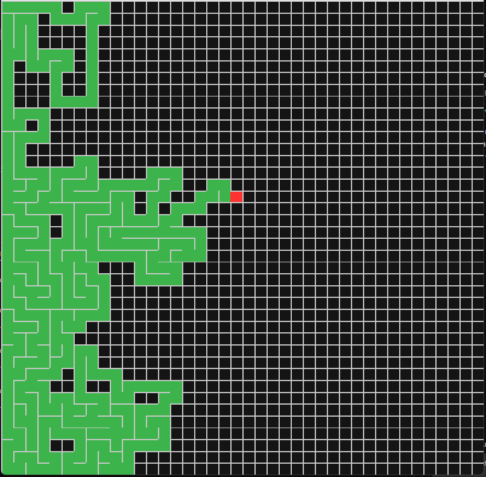

# Maze Generator

A simple and interactive maze generator built with Python and Pygame.

## Features

- Generates a random maze using depth-first search (DFS) algorithm
- Visualizes the maze generation process in real-time
- Colorful and modern UI
- Keyboard controls:
  - **Q**: Quit the application
  - **R**: Restart and generate a new maze
- Displays a message when the maze is complete

## Requirements

- Python 3.x
- Pygame

## Installation

1. Install Python 3 from [python.org](https://www.python.org/).
2. Install Pygame:
   ```bash
   pip install pygame
   ```

## Usage

1. Run the program:
   ```bash
   python main.py
   ```
2. Watch the maze being generated.
3. When the maze is complete, use the following keys:
   - Press **R** to generate a new maze.
   - Press **Q** to quit.

## Customization

- You can change the maze size by editing the `ROWS` and `COLS` variables in `main.py`.
- Colors and window size can also be customized in the code.

## Screenshot



---
